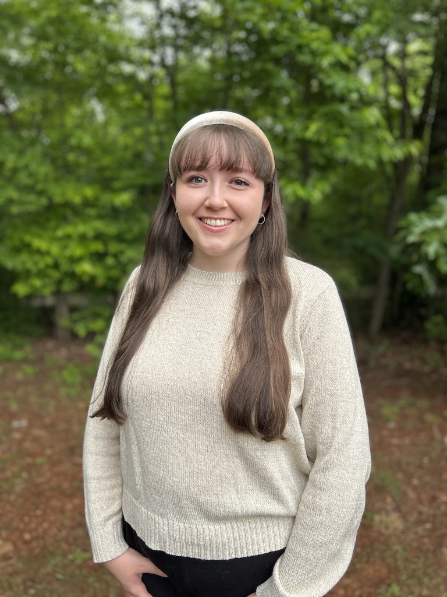

# Hannah Ayers
Teen Services Library Assistant

## EDUCATION
### Wayne State University – Detroit, Michigan 	
Expected Graduation: August 2026
Master of Library and Information Science
GPA: 4.0

### Hollins University – Roanoke, Virginia	Graduation: May 2023
Bachelor of the Arts in English with a Creative Writing Discipline and Film Minor	
GPA: 3.90
Honors: Deans List for seven consecutive semesters, Hollins Presidential Scholar, Member of Sigma Tau Delta English Honor Society, 1st Class Honors
### CAPA, The Global Education Center – London, UK	January 2022 – April 2022
Honors: Academic Achievement Awards for Theatre in the City and Shakespeare and London courses

## WORK EXPERIENCE
### Franklin County Public Library
Franklin County, Virginia	October 30, 2023 – Present

**Teen Services Senior Library Assistant**
- Planned and executed programming for teens ages 12 to 17
- Maintained the Teen Room, including managing seasonal decorations, displays, and passive programming
- Selected young adult books for a teenage audience
- Performed circulation tasks while assisting with other youth services programs

**Library Aide**
- Performed circulation tasks such as charging and discharging materials, issuing library cards, and paying fees in Book Systems
- Aided library patrons, including children, in finding materials, placing holds, and answering general questions
- Maintained an organized workplace through shelving materials, shelf reading, and cleaning up after patrons
- Assisted in preparing decorations and crafts to ensure the library was engaging

### Virginia Western Community College 
Roanoke, Virginia	August 3, 2023 – October 25, 2023

**Bookstore Sales Associate**
- Accurately operated the register to ensure efficient checkout and return of both digital and physical products
- Assisted patrons in navigating bookstore website and finding materials in the store 
- Collected student information for emailing digital books and updating rental accounts

### White House Historical Association 
Washington D.C.	January 3 – January 27, 2023
**Publishing Intern**
- Conducted photo research using physical and digital sources to find images for The White House History Quarterly and upcoming books
- Proofread articles using the house style sheet to improve grammar and clarity
- Created an outline for a future publication using past publications and additional online research
- Assisted in filing, updating records, and mailing to maintain a more efficient workplace

### Roanoke Higher Education Center 
Roanoke, Virginia	June 2, 2022 – August 25, 2022

**Library Assistant**
- Checked in, checked out, and shelved books according to the Library of Congress system to ensure patrons had access to print materials 
- Assisted patrons in using technology such as printing, connecting to computers, using online databases, lamination, and faxing 
- Followed opening and closure procedures without supervision 
- Assisted other offices with administrative duties including mailing, updating records, and program planning 
- Collected payments for overdue fees and use of library technologies

### Wyndham Robertson Library 
Roanoke, Virginia	September 4, 2019 – December 10, 2022

**Library Aide**
- Assisted students with research needs using online databases and catalogues as well as with finding titles on the library floor and using library technology
- Checked and shelved books according to the Library of Congress system regularly to ensure students had access to titles
- Collaborated with peers to complete hourly tasks to maintain an orderly and efficient library environment for patrons

